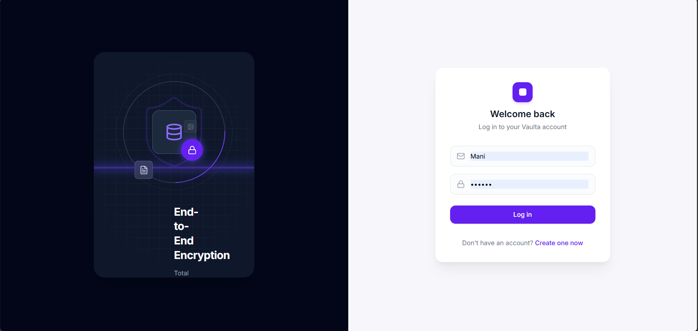
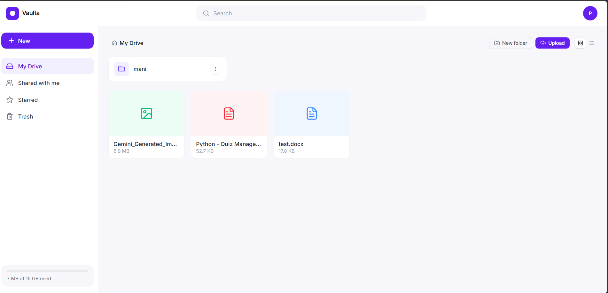
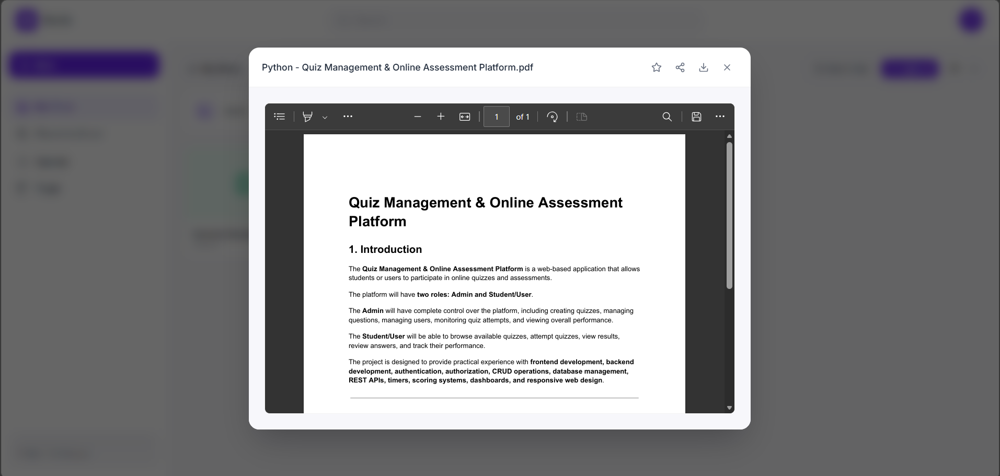
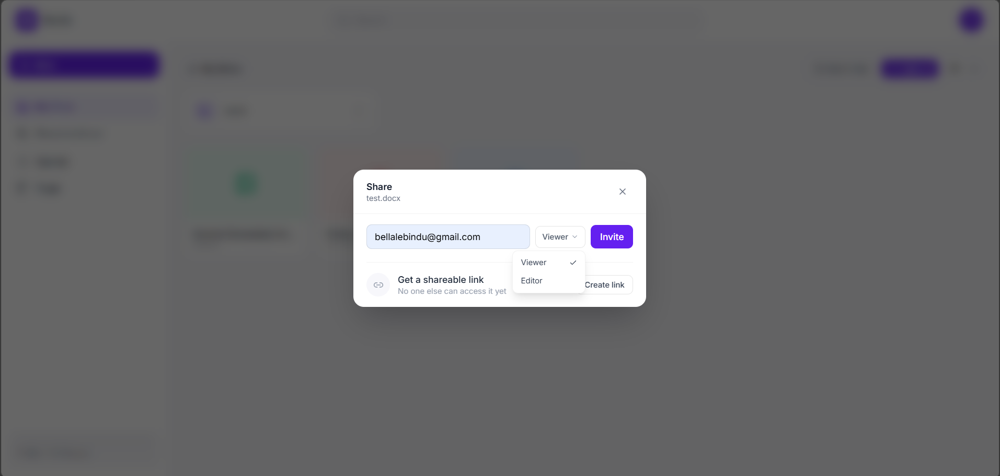

# Vaulta

A cloud-based media file storage and sharing service — a Google Drive-style app with folders, file sharing, public links, search, starring, and trash.

**Stack:** FastAPI + SQLAlchemy + PostgreSQL (Supabase) on the backend, React + Vite + Tailwind + Framer Motion + React Query on the frontend.

## Features

- Email/password auth with JWT access + refresh tokens
- Nested folders, drag-and-drop file uploads with progress
- File preview (images, PDFs, text), version history
- User-to-user sharing with viewer/editor roles
- Public shareable links, with optional password protection and expiry
- Search, starring, trash with restore
- Fully responsive, animated UI

## Project structure

```
vaulta/
├── backend/     # FastAPI API — see backend/README.md for setup
└── frontend/    # React + Vite SPA
```

## Quick start

**Backend:**
```bash
cd backend
python -m venv venv
source venv/bin/activate   # Windows: venv\Scripts\activate
pip install -r requirements.txt
cp .env.example .env       # fill in your DATABASE_URL, SECRET_KEY, etc.
alembic upgrade head
uvicorn app.main:app --reload
```
Full details in [`backend/README.md`](backend/README.md).

**Frontend:**
```bash
cd frontend
npm install
npm run dev
```

The frontend expects the backend running at `http://localhost:8000` by default (configurable via `VITE_API_URL` in a `frontend/.env` file).

## Screenshots

<!--
  Add your screenshots to docs/screenshots/ and they'll render right here
  on GitHub automatically. Suggested shots: login, My Drive (grid view),
  file preview, share modal, mobile view. Recommended width ~1200px for
  desktop shots so they don't look huge on the repo page.
-->

| | |
|---|---|
|  |  |
|  |  |

## License

MIT